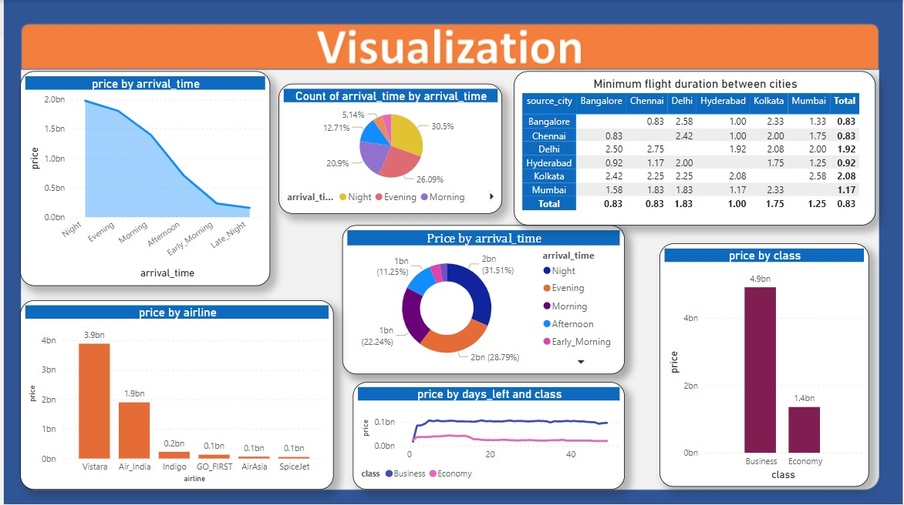

# Data visualization of flight price prediction dataset using PowerBI
### *Dataset Link*: [https://www.kaggle.com/datasets/shubhambathwal/flight-price-prediction](https://www.kaggle.com/datasets/shubhambathwal/flight-price-prediction)

## Dataset Description
- This dataset contains information about the flight prices of various airlines obtained from “Ease My Trip” website.
- The dataset contains various features like Airline, Flight, source city, destination city, class, price, duration etc.

## Visualizations
- *Price by arrival time Stacked Area Chart*: The chart shows the variation of price according to arrival time.
- *Count of arrival time by arrival time Pie Chart*: The chart shows the distribution of people travelling in different arrival times.
- *Minimum flight duration between cities matrix*: The matrix shows the minimum flight duration between cities.
- *Price by airline Clustered Column Chart*: The chart shows the variation of price according to airline.
- *Price by arrival time Donut Chart*: The chart shows the variation of price according to arrival time.
- *Price by class Clustered Column Chart*: The chart shows how price varies for business and economy class.
- *Price by days left with respect to class line chart*: The chart shows how the price varies with respect to days left for business and economy class.
## Visualization Report
